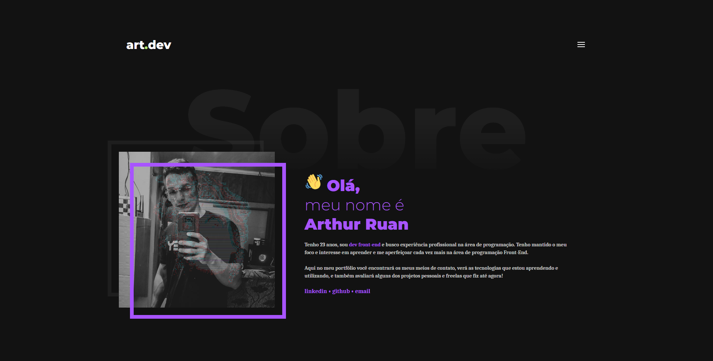

# Meu Portfólio em WordPress

Bem-vindo ao repositório do tema WordPress do meu portfólio! Este tema é usado para apresentar meu trabalho como desenvolvedor front-end e outros projetos pessoais. Você pode visualizar o tema em ação no meu site http://arthurdev.website/

## Visão Geral

Este projeto é um tema WordPress personalizado criado para exibir meu portfólio de maneira eficaz e elegante. Ele foi desenvolvido com foco na apresentação de projetos, habilidades e um pouco sobre mim de forma organizada.

## Funcionalidades

O tema WordPress do meu portfólio inclui as seguintes funcionalidades:

- **Página Inicial Personalizável**: Apresentação principal com informações sobre mim.

- **Seção de Habilidades**: Uma lista com algumas de minhas habilidades técnicas e tecnologias em que sou proficiente.

- **Seção de Projetos**: Uma página de projetos onde detalho alguns de meus trabalhos com capturas de tela, descrições e links.

- **Página de Contato**: Uma página de contato para que os visitantes possam entrar em contato comigo facilmente.

- **Responsividade**: O tema é totalmente responsivo, garantindo uma ótima experiência em dispositivos móveis.

- **Light e Dark Mode**: O tema conta com modo claro e escuro, que é detectado automáticamente pelo site ou segue a preferência definida no menu pelo usuário.

## Como Usar

Para usar este tema WordPress, siga estas etapas:

1. **Clone o Repositório**: Clone este repositório em seu ambiente local.

2. **Instalação do WordPress**: Certifique-se de ter o WordPress instalado em seu servidor.

3. **Instale o Tema**: Copie a pasta do tema para o diretório de temas do seu site WordPress.

4. **Ative o Tema**: Ative o tema através do painel de controle do WordPress.

5. **Personalização**: Personalize o conteúdo do tema, incluindo projetos, informações pessoais e configurações.

6. **Publicação**: Publique seu site com o novo tema ao vivo.

## Contribuições

Contribuições para melhorar este tema são bem-vindas! Se você tem sugestões de melhorias, encontrou bugs ou deseja adicionar recursos, fique à vontade para enviar pull requests ou abrir problemas.

## Licença

Espero que este tema WordPress ajude você a apresentar seu trabalho e habilidades de maneira eficaz. Sinta-se à vontade para usá-lo como inspiração ou base para o seu próprio portfólio!

http://arthurdev.website/
